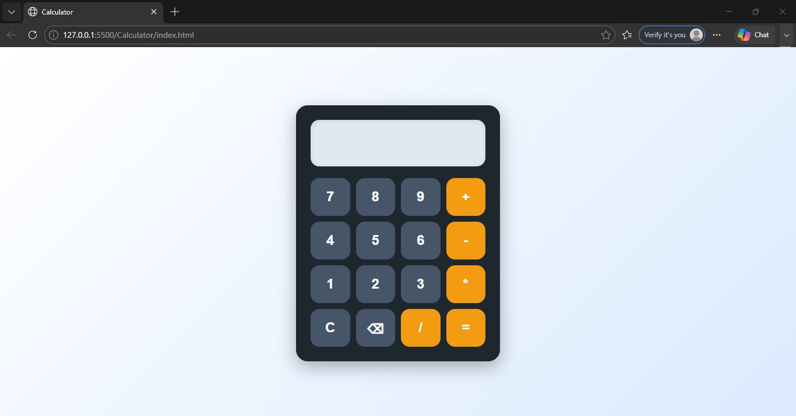

<div align="center">

# 🧮 Responsive Web Calculator

A modern calculator web application built using HTML, CSS, and JavaScript.

</div>

---

## ✨ Features

- Basic arithmetic operations
- Responsive user interface
- Clean and modern design
- Interactive button controls
- Lightweight and fast

---

## 🛠️ Tech Stack

- HTML
- CSS
- JavaScript

---

## 📸 Demo



---

## 🚀 How to Run

1. Clone the repository

```bash
git clone <repository-url>
```

2. Open `index.html` in your browser

---

## 🔮 Future Enhancements

- Keyboard support
- Scientific calculator functions
- Dark/Light mode toggle
- Calculation history

---

## 👩‍💻 Author

**Madhura Malap**
